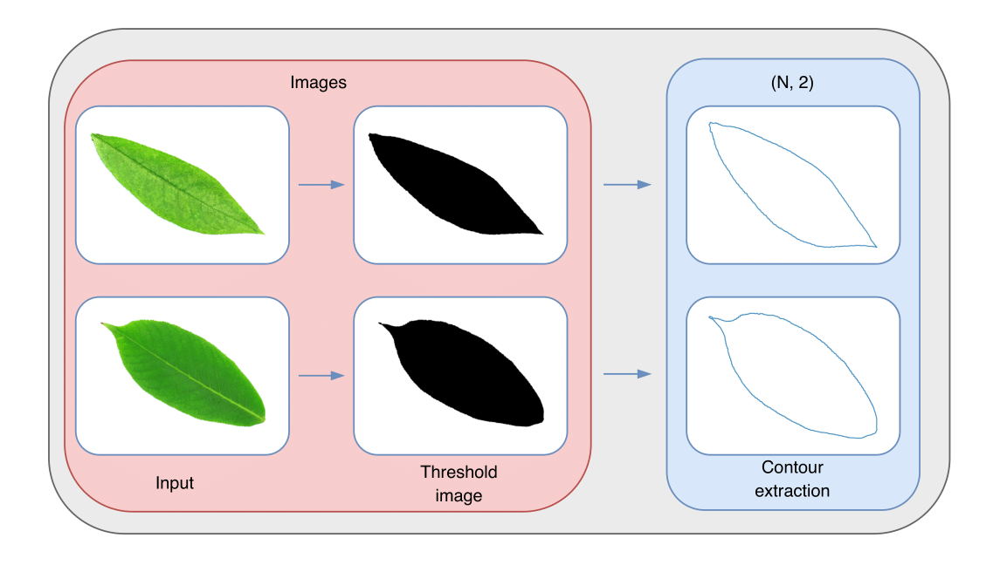
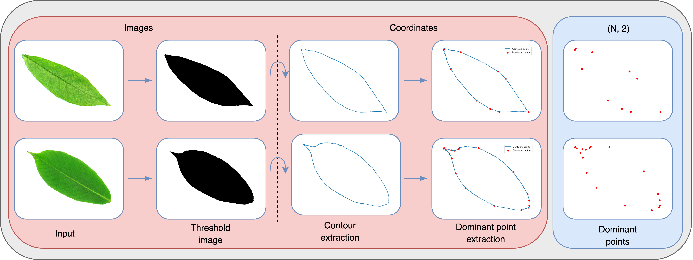
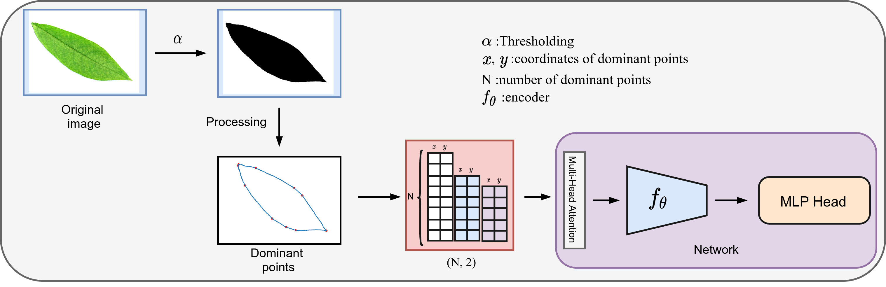

## PolygoNet: Leveraging Polygonal Contours For Efficient Image Classification with deep neural network

## Preprocessing Pipeline 
### Contours 
<p align="center"> 
  
</p> 

### MATC Dominant points
<p align="center"> 
  
</p> 


## PolygoNet Architecture 
<p align="center"> 
  
</p> 

## Dependencies 
For the different parts you can install required dependencies by running the following command: 

### For MATC
  #### Install in local 
```bash 
  bash install_MATC.sh
````
  #### Use Docker 
```bash
  docker build -t matc .
```
### For Deep Learning pipeline 
  ```bash
  virtualenv -p python3 venv 
  source venv/bin/activate
  python -m pip install -r requirements.txt 
  ````
## Usage 
### Contours extraction and SDP files generation
`INPUT_PATH` is the path to the folder containing the images. 
`OUTPUT_PATH` is the path to the folder where the SDP files will be saved. 
```bash
python data/generate_sdp.py INPUT_PATH OUTPUT_PATH 
````
### MATC Dominant points extraction 
`INPUT_SDP_PATH`: path to the SDP files gnerated in the previous step. 
`OUTPUT_SDP_PATH`: path to the folder where the Dominants points will be saved in `.sdp` format. 

#### Local 
```bash
cd MATC/src 
bash run.sh INPUT_SDP_PATH OUTPUT_SDP_PATH
````
#### Using Docker 
```bash
docker run -it --rm -v INPUT_SDP_PATH:/input -v OUTPUT_SDP_PATH:/output matc 
````
### Training the model 
`config.yaml` is the configuration file. 
```bash
python supermain.py --config config/config.yaml
